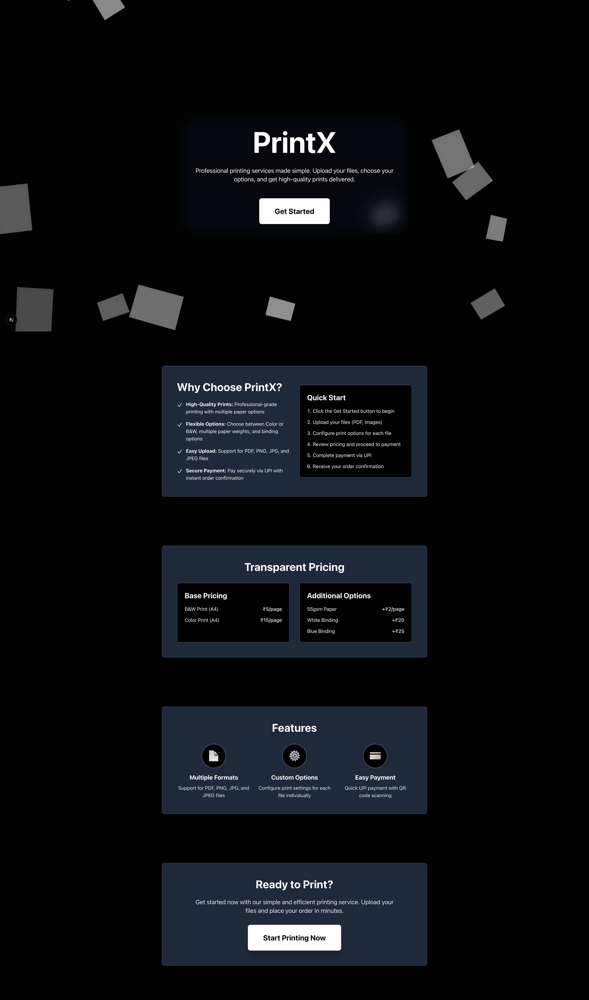
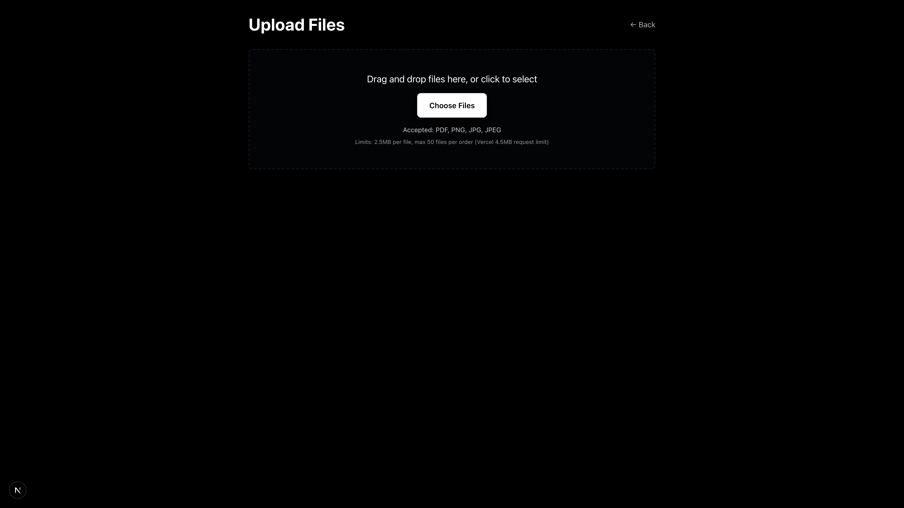
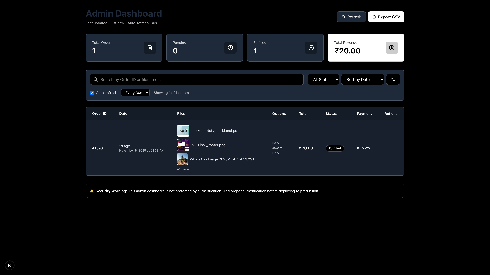
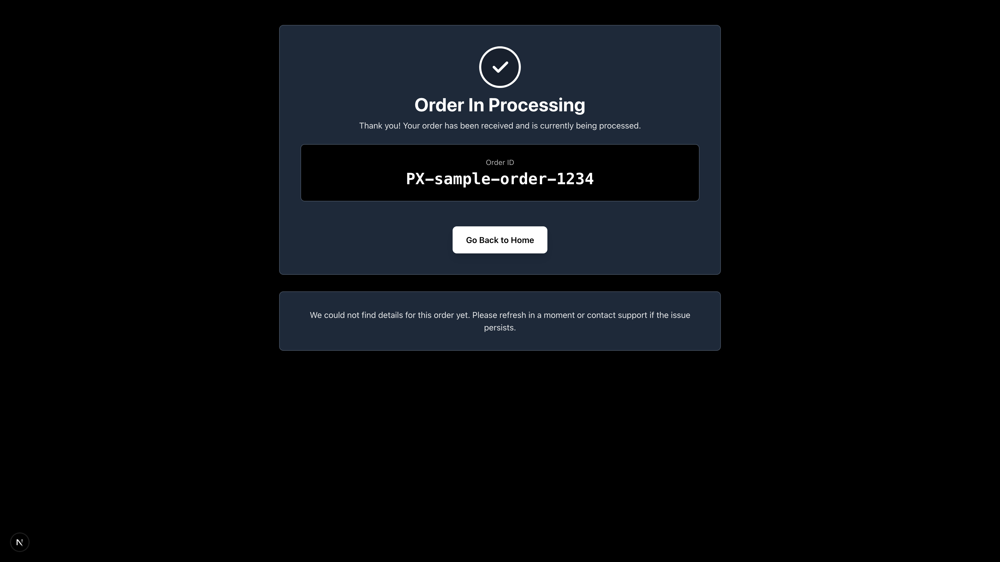

# PrintX

A minimal Next.js + TypeScript MVP for print ordering with a sleek black & white theme. This is a production-light shell for local testing.

## Features

- **Single-page user flow**: Upload files, configure print options, pay via UPI QR code
- **Admin dashboard**: View and manage orders
- **Google Drive integration**: Placeholder for file uploads (ready to configure)
- **File handling**: Support for PDF, PNG, JPG, JPEG
- **Dynamic pricing**: Based on color, paper GSM, and binding options

## Screenshots

<div align="center">

### Home Page

*Landing page with animated papers background and hero section*

### File Upload

*Drag and drop file upload interface with print options configuration*

### Payment & Order Review

*UPI QR code payment interface with order summary*

### Admin Dashboard

*Admin dashboard with order management, statistics, and filtering options*

### Order Status

*Order confirmation and status page with order details*

</div>

> **Note:** Screenshots are stored in the `docs/images/` directory. See [docs/images/README.md](docs/images/README.md) for instructions on how to add or update screenshots.

## Getting Started

### Prerequisites

- Node.js 18+ and npm

### Installation

1. Install dependencies:
```bash
npm install
```

2. Run the development server:
```bash
npm run dev
```

3. Open [http://localhost:3000](http://localhost:3000) in your browser

## Google Drive Integration

The app includes placeholder Google Drive integration. To enable actual file uploads:

### Setup Steps

1. **Enable Google Drive API**:
   - Go to [Google Cloud Console](https://console.cloud.google.com/)
   - Create a new project or select an existing one
   - Enable the Google Drive API

2. **Create OAuth 2.0 Credentials**:
   - Go to "Credentials" in the Google Cloud Console
   - Click "Create Credentials" → "OAuth client ID"
   - Choose "Web application"
   - Add authorized redirect URI: `http://localhost:3000`
   - Save and note your Client ID and Client Secret

3. **Get Refresh Token**:
   - Use the OAuth 2.0 Playground or a script to get a refresh token
   - Follow the OAuth 2.0 flow to obtain the refresh token

4. **Configure Environment Variables**:
   - Create a `.env.local` file in the project root:
   ```env
   GDRIVE_CLIENT_ID=your_client_id_here
   GDRIVE_CLIENT_SECRET=your_client_secret_here
   GDRIVE_REFRESH_TOKEN=your_refresh_token_here
   ```

5. **Update Drive Implementation**:
   - Open `lib/drive.ts`
   - Uncomment the Google Drive API implementation
   - The placeholder will automatically switch to real uploads when credentials are detected

### Testing Without Google Drive

The app works without Google Drive credentials. Files will be assigned placeholder IDs, and the order flow will function normally for testing purposes.

## Project Structure

```
printx-simple/
├── pages/
│   ├── index.tsx          # Main user flow (hero → upload → payment)
│   ├── admin.tsx          # Admin dashboard
│   ├── api/
│   │   └── order.ts       # Order API (GET, POST, PATCH)
│   └── _app.tsx           # App wrapper
├── components/
│   ├── FileUploader.tsx   # File upload component with options
│   ├── PriceCalculator.tsx # Pricing logic and display
│   └── QRCodeDisplay.tsx  # UPI QR code generator
├── lib/
│   └── drive.ts           # Google Drive upload helper
├── data/
│   └── orders.json        # Orders storage (JSON file)
├── public/
│   └── uploads/
│       └── payments/      # Payment screenshots
└── styles/
    └── globals.css        # Black & white theme
```

## Pricing Formula

- **Base pricing**:
  - B&W page: ₹5 per A4 page
  - Color page: ₹15 per A4 page

- **Surcharges**:
  - 55gsm paper: +₹2 per page
  - White binding: +₹20 per PDF
  - Blue binding: +₹25 per PDF

- **Current limitation**: PDFs are counted as 1 page (TODO: implement PDF page parsing)

## API Routes

### `GET /api/order`
Returns all orders (used by admin dashboard)

### `POST /api/order`
Creates a new order. Accepts multipart/form-data with:
- `files`: Array of print files
- `paymentScreenshot`: Payment confirmation image
- `orderData`: JSON string with order details

### `PATCH /api/order`
Updates an order status. Body: `{ orderId, status }`

## Security Notes

⚠️ **Important**: This is an MVP shell for local testing only.

- **No authentication**: The admin dashboard is not protected. Do not deploy to production without adding proper authentication.
- **File storage**: Payment screenshots are stored in `/public/uploads/payments/` and served statically. In production, use secure cloud storage.
- **No payment verification**: The app accepts payment screenshots but does not verify payments automatically. Implement payment provider integration for production.
- **No rate limiting**: API routes have no rate limiting. Add rate limiting for production use.

## TODOs for Production

1. **Authentication**: Add authentication to admin dashboard (e.g., NextAuth.js)
2. **PDF page parsing**: Implement actual PDF page count parsing
3. **Payment verification**: Integrate with payment provider API
4. **Google Drive**: Complete Google Drive integration setup
5. **Error handling**: Add comprehensive error handling and logging
6. **Database**: Replace JSON file storage with a proper database
7. **File storage**: Move to secure cloud storage (S3, etc.)
8. **Rate limiting**: Add API rate limiting
9. **Validation**: Add input validation and sanitization
10. **Testing**: Add unit and integration tests

## Development Commands

```bash
# Install dependencies
npm install

# Run development server
npm run dev

# Build for production
npm run build

# Start production server
npm start

# Run linting
npm run lint
```

## Deployment

### Vercel Deployment

This project is ready to deploy on Vercel:

1. **Push to GitHub** (already done):
   ```bash
   git push origin main
   ```

2. **Deploy to Vercel**:
   - Go to [Vercel](https://vercel.com)
   - Click "New Project"
   - Import your GitHub repository: `StarkAg/printx-simple`
   - Vercel will auto-detect Next.js settings
   - Click "Deploy"

3. **Environment Variables** (optional, for Google Drive):
   - In Vercel project settings, add:
     - `GDRIVE_CLIENT_ID`
     - `GDRIVE_CLIENT_SECRET`
     - `GDRIVE_REFRESH_TOKEN`

4. **Important Notes for Production**:
   - File uploads are stored in `/public/uploads/` (ephemeral on Vercel)
   - For production, use cloud storage (S3, Cloudinary, etc.)
   - Orders are stored in `data/orders.json` (ephemeral on Vercel)
   - For production, use a database (PostgreSQL, MongoDB, etc.)
   - Admin dashboard is not protected - add authentication before deploying

### Repository

- GitHub: https://github.com/StarkAg/printx-simple

## License

Private project for local testing.
